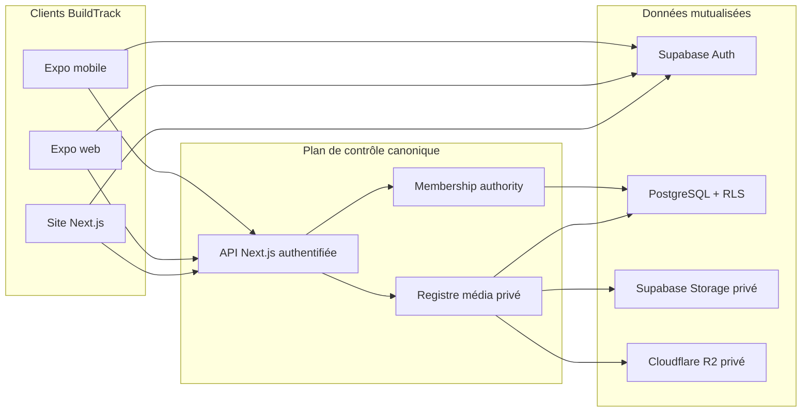
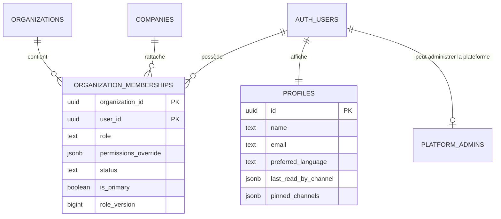
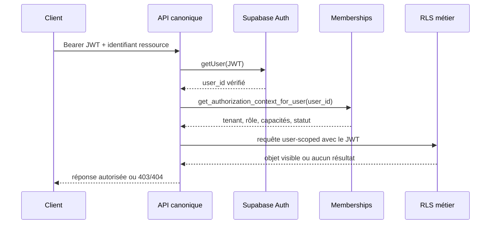
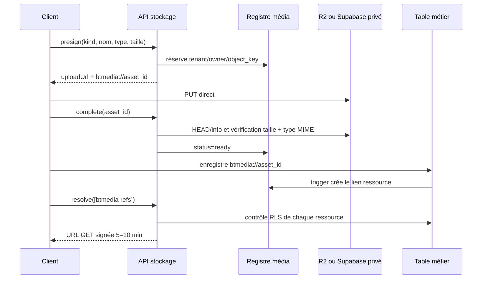

# BuildTrack — architecture SaaS multi-tenant

## Portée

BuildTrack est un produit de suivi de chantier composé de trois surfaces qui
partagent la même autorité et les mêmes données :

- l’application Expo pour Android, iOS et le web ;
- le site Next.js (landing page et expérience web) ;
- l’API Next.js canonique pour les opérations serveur.

Le modèle standard est **mutualisé avec isolation logique stricte** : plusieurs
organisations utilisent le même projet Supabase, mais aucune donnée, permission
ou clé média n’est accessible entre deux organisations. Une offre **silo** peut
déployer Supabase, R2 et l’API dans des comptes dédiés pour un client soumis à
des exigences contractuelles ou réglementaires supérieures.

## Vue d’ensemble



## Invariants de sécurité

1. `profiles` contient uniquement l’identité d’affichage et les préférences.
   Ses anciennes colonnes `role`, `organization_id`, `company_id` et
   `permissions_override` sont une projection de compatibilité non modifiable
   par le client.
2. `organization_memberships` est l’unique autorité d’organisation, de rôle,
   de capacités, de statut et de version d’autorisation.
3. `private.platform_admins` est distinct des rôles d’organisation. Un
   administrateur plateforme n’est pas créé par une valeur envoyée par le
   client.
4. Le tenant d’une écriture authentifiée provient de `auth.uid()` et du
   membership actif. `organization_id` reçu dans un payload est écrasé.
5. Les politiques RLS restrictives bloquent les clients anonymes, les lignes
   sans tenant et celles d’une autre organisation, même si une ancienne
   politique permissive existe.
6. Les relations sensibles portent une clé composite
   `(organization_id, foreign_id)` afin qu’une ligne du tenant A ne puisse pas
   référencer un parent du tenant B.
7. Les invitations, memberships, abonnements et organisations sont modifiés
   par des RPC contrôlées ; aucune mutation d’autorité directe n’est accordée
   aux rôles clients.
8. Les endpoints serveur vérifient le JWT, l’organisation et la ressource
   visée. Le service role n’est jamais exposé au navigateur ou à l’application.
9. Les objets média sont identifiés en base par `btmedia://<asset_id>`. Les clés
   de stockage et URL signées restent côté serveur.
10. Toute matrice utilisateur A × objet B doit échouer hors tenant dans la CI.

## Autorité et rôles



Les rôles d’organisation sont `admin`, `conducteur`, `chef_equipe`,
`magasinier`, `observateur` et `sous_traitant`. Les capacités individuelles
peuvent être accordées ou retirées dans `permissions_override` par un
administrateur autorisé. `super_admin` est une projection d’un enregistrement
actif dans `private.platform_admins`, jamais un rôle de membership.

Le changement de rôle et la révocation incrémentent `role_version`, et chaque
mutation est inscrite dans `private.authorization_audit_log`.

## Résolution d’une requête



L’API n’accepte jamais un tenant de confiance dans le corps de la requête. Pour
une ressource nommée par le client, elle réutilise un client Supabase portant le
JWT utilisateur : la RLS métier reste donc applicable, y compris pour les vues
plus étroites des sous-traitants.

## Intégrité relationnelle

Les tables métier ont une politique restrictive et un trigger
`private.enforce_actor_tenant`. Les relations suivantes sont notamment
composites : chantier–réserve, plan–réserve, visite–réserve, tâche–réserve,
chantier–document, canal–message, chantier–inventaire, produit–mouvement,
entreprise–mouvement, membership–préférences et membership–push token.

Les contraintes ajoutées avec `NOT VALID` protègent immédiatement les nouvelles
écritures. Les anciennes lignes orphelines restent quarantainées jusqu’à leur
réconciliation, puis chaque contrainte doit être validée explicitement.

## Médias privés



`tenant_media_objects` enregistre le tenant, le propriétaire, le backend, le
bucket, la clé, le type, la taille, l’ETag et l’état de cycle de vie.
`tenant_media_links` relie l’objet à une ou plusieurs ressources métier. Le
garbage collector ne supprime un objet qu’après disparition de tous ses liens ;
il récupère aussi les uploads incomplets ou complets jamais rattachés.

### Déploiement progressif obligatoire

La migration du registre démarre en mode `dual_read`. Les anciennes URL restent
lisibles le temps que les clients compatibles soient diffusés. La bascule
privée exige ensuite un appel service-only explicite :

```sql
select public.server_finalize_private_media_storage(
  p_minimum_client_version => 'VERSION_COMPATIBLE',
  p_confirm => true
);
```

Avant cet appel, il faut vérifier : API déployée, application Expo/OTA et site
Next.js compatibles, absence de média non enregistré, taux de résolution sans
erreur, version minimale imposée et procédure de retour arrière testée. Le
cutover rend les buckets `photos` et `documents` privés et active les politiques
restrictives d’upload sur les clés enregistrées.

## Serveur canonique

Les routes sensibles vivent uniquement dans `vercel-app/app/api`. Les anciens
endpoints Express et Expo ont été supprimés. Les clients construisent leur URL
à partir de `EXPO_PUBLIC_API_URL` (ou `EXPO_PUBLIC_APP_URL` en repli), y compris
dans Expo web ; l’origine du navigateur ne remplace pas une API configurée.

Le serveur canonique gère notamment : emails, mot de passe, notifications push,
traduction, PDF, préférences administrateur, recherche code-barres et cycle de
vie des médias. Les routes publiques intentionnelles disposent de leur propre
capacité vérifiable (par exemple le token HMAC d’une réserve partagée).

## Mutualisé et silo

| Mode | Base / stockage | Isolation | Usage recommandé |
|---|---|---|---|
| Mutualisé | Supabase et R2 partagés | RLS, clés composites, registre tenant | Offre standard |
| Silo | Supabase, R2 et secrets dédiés | Frontière d’infrastructure + contrôles applicatifs | Contrats sensibles, résidence ou clé dédiée |

Le code métier reste identique. Le provisionnement silo fournit des variables,
secrets, domaines, sauvegardes et journaux distincts. Aucune synchronisation de
données inter-client n’est activée par défaut.

## Tests et preuves

- `tests/tenantIsolationContracts.test.ts` vérifie les contrats de code et la
  matrice logique.
- `supabase/tests/bootstrap_tenant_isolation.sql` construit une base jetable
  avec des politiques historiques volontairement permissives.
- `supabase/tests/tenant_isolation_matrix.sql` prouve l’isolation A×B, le tenant
  dérivé, l’impossibilité d’auto‑promotion, les clés composites et le stockage
  privé.
- `.github/workflows/security-gates.yml` applique les migrations de production
  inchangées sur PostgreSQL 17 avant d’exécuter la matrice.

## Stack actuelle

| Couche | Technologie |
|---|---|
| Mobile / Expo web | Expo 54, React Native 0.81, React 19, TypeScript 5.9 |
| Site et API | Next.js 16, React 19 |
| Identité / données | Supabase Auth, PostgreSQL, RLS, Realtime |
| Médias | Cloudflare R2 ou Supabase Storage, registre privé commun |
| Hors-ligne | AsyncStorage, React Query et file de synchronisation |
| CI | Vitest, TypeScript, PostgreSQL 17, GitHub Actions |

## Références d’implémentation

- `supabase/migrations/20260810192253_organization_membership_authority.sql`
- `supabase/migrations/20260810193111_enforce_tenant_integrity_and_rpc_scope.sql`
- `supabase/migrations/20260810193713_add_private_tenant_media_registry.sql`
- `vercel-app/lib/server-auth.ts`
- `vercel-app/lib/private-media-server.ts`
- `lib/media.ts`
